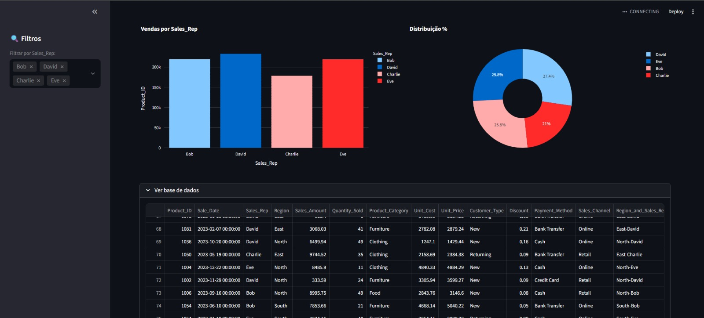

Dashboard Executivo de Vendas com Streamlit

Este projeto é um Web App interativo desenvolvido em Python para análise de dados de vendas. Ele permite que gestores visualizem KPIs críticos e filtrem resultados por categoria em tempo real.

Funcionalidades
- Cálculo automático de **Faturamento Total** e **Ticket Médio**.
- Gráficos dinâmicos de barras e distribuição (rosca).
- Filtros interativos na barra lateral.
- Visualização da base de dados bruta de forma organizada.

Tecnologias Utilizadas
- **Python**: Linguagem base.
- **Pandas**: Manipulação e tratamento dos dados.
- **Streamlit**: Criação da interface web.
- **Plotly**: Gráficos interativos.

Como rodar o projeto
1. Instale as dependências: `pip install -r requirements.txt`
2. Execute o app: `streamlit run app.py`

  

